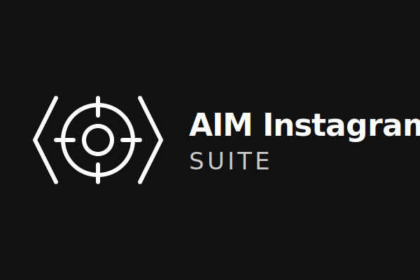

  
  
  # 🎯 AIM Instagram Suite (v1.2.0)
  
  **Локальный AI-ассистент (MCP Server) для анализа, реверс-инжиниринга и генерации вирусного контента в Instagram (Reels & Carousels).**
  
  
  
  
  

  [Read in English 🇬🇧](README.en.md)

---

## ⚡ Что это такое?

**AIM Instagram Suite** — это набор из 13 инструментов (tools), работающих как локальный сервер [Model Context Protocol (MCP)](https://modelcontextprotocol.io/). Он подключается к Claude Desktop или вашему IDE (Cursor, Windsurf) и позволяет AI-агенту автономно анализировать видео, скачивать Reels и карусели, оценивать их виральность и автоматически рендерить новые посты в премиум-дизайне прямо у вас на компьютере. **Без платных API и сторонних сервисов.**

## 🛠 Авто-установка через Claude Code

Установка этого проекта происходит полностью автоматически.
Просто скопируйте этот промпт и вставьте его в **Claude Code** (или Cursor/Windsurf):

> Склонируй репозиторий `https://github.com/fsbtactic-code/aim-instagram-suite.git` в новую папку "AIM-Suite" в моих Документах (или на рабочем столе).
> Перейди в эту папку, установи все зависимости через `npm run setup` и скомпилируй проект через `npm run build`. 
> Найди конфиг `claude_desktop_config.json`, добавь в `mcpServers` сервер "aim-instagram-suite": команда `node`, аргумент — абсолютный путь к `dist/index.js` в папке, куда мы только что склонировали.
> Перезагрузи Claude Desktop.

После выполнения промпта все инструменты `aim_` (рендеринг каруселей, анализ видео и т.д.) будут готовы к работе!

---

## 🚀 Примеры промптов для Claude

Просто скопируйте и вставьте эти фразы в чат с Claude (когда подключен MCP сервер):

### 1. Анализ конкурентов и "Кража" структуры
> 💬 *"Разбери эту карусель конкурента: [ссылка на Instagram]. Распиши мне, какие триггеры они используют на каждом слайде для активации FOMO (синдрома упущенной выгоды). Сохрани анализ в файл конкурент.md"*

> 💬 *"Скачай и проанализируй вот этот вирусный Reel: [ссылка на TikTok/Reel]. Сделай реверс-инжиниринг его монтажа (найди 'провисания' с помощью детектора скуки) и вытащи его транскрипт."*

### 2. Оценка вашего контента перед публикацией (Индекс Виральности)
> 💬 *"Я снял новое видео C:/Users/МоиВидео/reel.mp4. Прогони его через AIM Score Video. Моя ниша — 'Инвестиции для новичков'. Дай мне индекс виральности и топ-3 конкретных совета, как улучшить хук в первые 3 секунды."*

> 💬 *"Проверь виральность этих PNG-картинок (моя новая карусель). Папка: C:/Users/Carousel. Какова оценка дизайна, читаемости и CTA?"*

### 3. Автоматическая генерация и рендер Каруселей
> 💬 *"Сделай новую карусель про '5 ошибок выгорания на фрилансе'. Используй структуру 'day-in-life' (день из жизни). Затем отрендери её в теме Neo-Brutalism (тема 2) в формате 1080x1350 и сохрани в папку C:/Users/Render."*

> 💬 *"Сгенерируй карусель-кейс 'Как я заработал первый миллион'. Обязательно используй лейауты 'хорошо-плохо' и табличную 'сравнение A vs B'. На каждом слайде добавь CTA: 'Напиши слово ДЕНЬГИ в Директ'. Отрендери в теме Apple Premium (5)."*

---

## 🧩 Архитектура: Модули (13 Инструментов)

### 🎬 Видео-аналитика
* `aim_evaluate_video` — Расчёт Индекса Виральности ВИДЕО (Хук, Динамика, Эмоции).
* `aim_analyze_viral_reels` — Скачивание и реверс-инжиниринг вирусных видео.
* `aim_generate_script` — Генератор сценариев на основе успешных конкурентов.
* `aim_analyze_hook` — Изолированный аудит плотности и силы первых 5 секунд (Хука).
* `aim_extract_pacing` — Машинный "Детектор скуки", ищущий провисания по ритму кадров.

### 🖼 Carousel Studio (Новое в 1.2!)
* `aim_score_carousel_virality` — Мультифакторная оценка каруселей (Воронка, Читаемость, Save-фактор).
* `aim_analyze_carousel` — Скачивает карусели конкурентов, клеит в коллаж, читает текст.
* `aim_localize_carousel` — Автоматический перевод и адаптация зарубежных каруселей-миллионников.
* `aim_viral_structure` — Библиотека из 12 научных шаблонов (Case Study, Hot Take, Checklist, Story Arc и др.).
* `aim_draft_carousel_structure` — AI-генератор JSON-структуры с эмодзи и разбивкой по ролям.
* `aim_render_premium_carousel` — **Puppeteer-Движок.** Сам рисует вашу карусель из JSON в готовые PNG-картинки с использованием 10 уникальных лейаутов (сетки, таблички, До/После) и 8 премиум-стилей (Glassmorphism, Cyberpunk, Neo-Brutalism).
* `aim_auto_brand_colors` — Адаптация тем рендера под ваши корпоративные HEX-цвета.

---

## 🎨 Система дизайна и Лейауты

Наш движок рендеринга `htmlRenderer` включает **10 умных лейаутов**:
1. `standard` (Текст + Эмодзи)
2. `hero-number` (Большая цифра по центру)
3. `grid-2x2` (4 блока сеткой сравнения)
4. `good-bad` (Сплит ✅ Правильно vs ❌ Ошибка)
5. `before-after` (ДО / ПОСЛЕ по вертикали)
6. `steps-3` (Три шага в ряд)
7. `quote` (Полноэкранная цитата)
8. `checklist` (Чек-лист с галочками)
9. `comparison` (Таблица сравнения A vs B)
10. `cta-final` (Финал с большим призывом)

А также поддерживает персистентный CTA-баннер на каждом слайде: *"Напиши слово X..."*

## ⚠️ Предупреждения и приватность
* **Zero APIs**: Вся работа (FFmpeg транскодинг, склейка кадров, Puppeteer рендер, скачивание `yt-dlp`) выполняется строго локально. 
* Единственный внешний процесс — Python Whisper (если установлен локально) или OCR/Vision анализ, который запускается самим Claude. Мы не сохраняем ваши данные.

## Разработчик
Создано с любовью для автоматизации Инстаграм-рутины.
[fsbtactic-code](https://github.com/fsbtactic-code)
