<div align="center">
  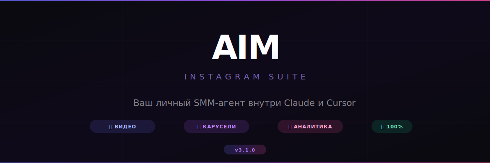
  
  [](https://nodejs.org/)
  []()
  []()
  []()
  []()
</div>

---

## 💡 Что это такое?

**AIM** — это ваш личный SMM-помощник, который живёт прямо внутри нейросети Claude.

Вы просто пишете обычным языком, что хотите — а ИИ делает всю работу:
скачивает видео конкурентов, перегоняет голос в текст, анализирует почему ролик залетел,
пишет вам сценарий, а потом **рисует готовые карточки для Инстаграм** — красивые, в фирменных цветах, без Canva и Figma.

### Как это работает:

<div align="center">
  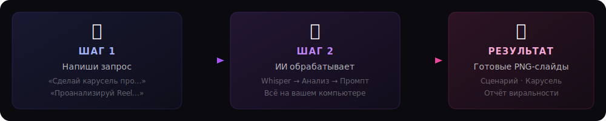
</div>

---

## 🔥 Что AIM умеет делать для вас

### 🕵️ Шпионить за конкурентами
> *«Дай мне ссылку на чужой Reel с миллионом просмотров — я разберу его по косточкам»*

AIM скачивает видео по ссылке (Instagram, TikTok, YouTube), **переводит голос в текст**, определяет на какой секунде зритель зацепился, и выдаёт вам:
- 📝 Полный транскрипт (текстовая расшифровка)
- 🎯 Почему работает хук (первые 3 секунды)
- 📐 Структуру сценария: что, когда и зачем было сказано
- ✍️ **Готовый сценарий** под вашу нишу по этой же формуле

**Зачем это вам:** Не изобретайте велосипед. Берёте чужой залетевший формат → адаптируете под себя → снимаете по готовому сценарию.

---

### 📊 Проверять ваше видео ДО публикации
> *«Оцени мой Рилс — залетит или нет?»*

Покажите ИИ ваше готовое видео, и он поставит ему оценку **от 0 до 100** по 7 критериям:

| Критерий | Что проверяет |
|----------|---------------|
| 🪝 Хук (25%) | Зацепят ли первые 3 секунды? |
| ⚡ Динамика (20%) | Не заскучает ли зритель на середине? |
| 🎵 Звук (15%) | Музыка, голос, ритм — всё ок? |
| 💡 Ценность (15%) | Есть ли польза для зрителя? |
| ❤️ Эмоции (12%) | Вызывает ли «вау» или «а это про меня»? |
| 🎨 Картинка (8%) | Качественный ли визуал? |
| 📢 Призыв (5%) | Есть ли CTA — что делать дальше? |

**Зачем это вам:** Узнаёте слабые места *до* публикации. Переснимите начало или ускорьте монтаж — и шансы залететь вырастут.

---

### 🎨 Рисовать карусели автоматически
> *«Сделай мне карусель '5 ошибок новичков в фитнесе'»*

Вы говорите тему — ИИ сам:
1. ✏️ Пишет текст для каждого слайда (от 3 до 15 штук)
2. 🎨 Выбирает подходящий шаблон (чек-лист, сравнение, цитата, большая цифра...)
3. 🖼️ Мгновенно рисует готовые PNG-картинки в выбранном дизайне
4. 💾 Сохраняет в папку — бери и публикуй

**Никаких водяных знаков. Никаких подписок. Никакого Canva.**

**Зачем это вам:** Вы экономите 1-2 часа дизайнерской работы на каждой карусели. Получаете профессиональный результат без навыков верстки.

---

## 🖼️ Примеры дизайнов

Один и тот же контент — 8 абсолютно разных стилей. Выбирайте под свой бренд:

<details>
<summary><b>✨ Glassmorphism — Матовое стекло (тренд 2024)</b></summary>
<br/>
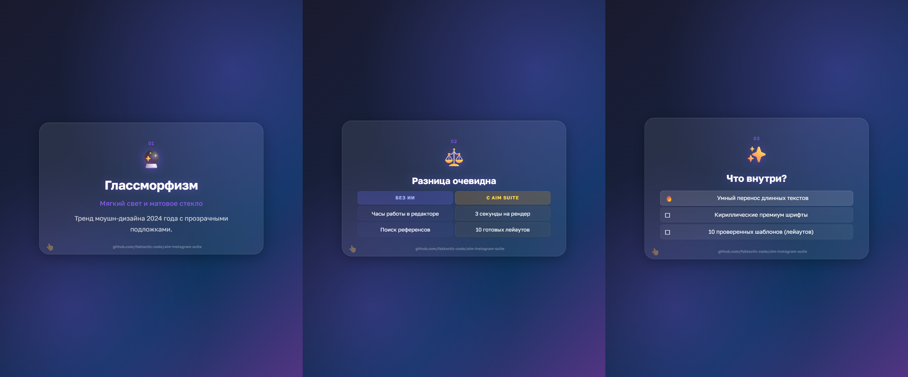
<br/><br/>
Полупрозрачные карточки с размытием на глубоком фиолетовом фоне. Идеально для: tech-блогов, стартапов, IT-услуг.
</details>

<details>
<summary><b>💥 Neo-Brutalism — Яркий и дерзкий</b></summary>
<br/>
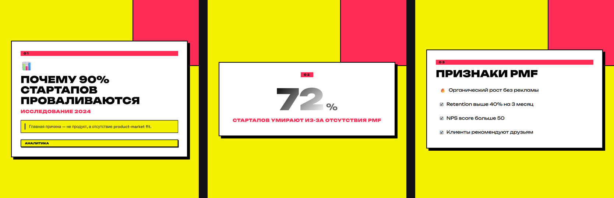
<br/><br/>
Кислотный жёлтый + жирные тени + крупный шрифт. Идеально для: молодёжных брендов, образовательных проектов, smm-агентств.
</details>

<details>
<summary><b>🤍 Minimalist Elegance — Журнальная эстетика</b></summary>
<br/>
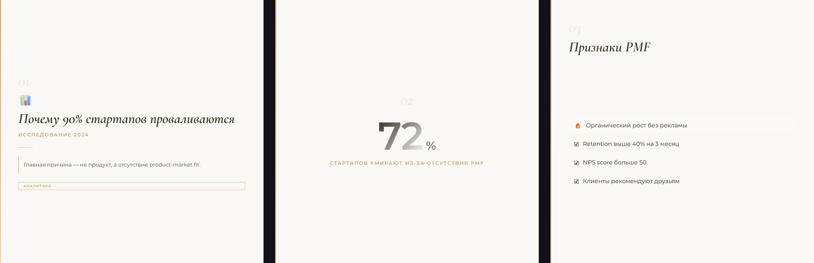
<br/><br/>
Тёплые бежевые тона, элегантная типографика. Идеально для: beauty-блогов, психологов, коучей, премиум-услуг.
</details>

<details>
<summary><b>🟩 Dark Cyberpunk — Неон и код</b></summary>
<br/>
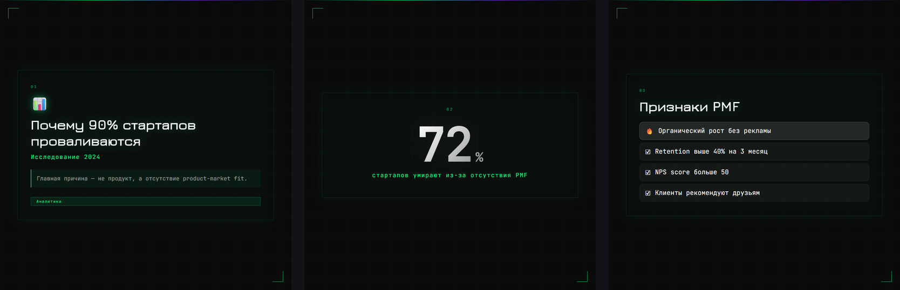
<br/><br/>
Чёрный фон, зелёный неон, моношрифт. Идеально для: разработчиков, крипто, геймеров, tech-стартапов.
</details>

<details>
<summary><b>🍏 Apple Premium — Тёмная роскошь</b></summary>
<br/>
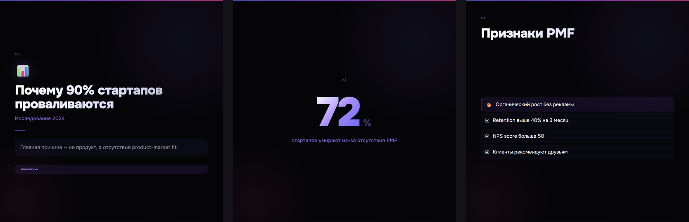
<br/><br/>
Стиль презентаций Apple: глубокий чёрный, градиентный текст, свечения. Идеально для: продуктовых презентаций, инвесторских питчей, премиум-брендов.
</details>

<details>
<summary><b>💿 Y2K / Acid — Ретро-интернет</b></summary>
<br/>
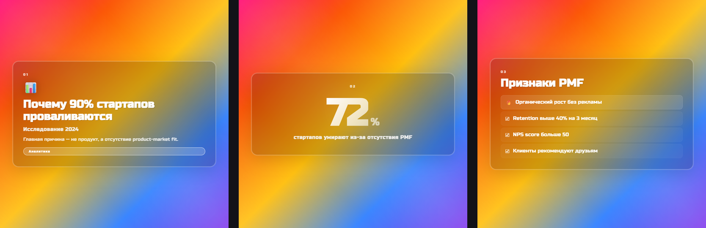
<br/><br/>
Радужные градиенты, ретро-шрифт, стеклянные карточки. Идеально для: креативных агентств, модных брендов, lifestyle-блогов.
</details>

<details>
<summary><b>📘 EdTech Trust — Экспертный и спокойный</b></summary>
<br/>
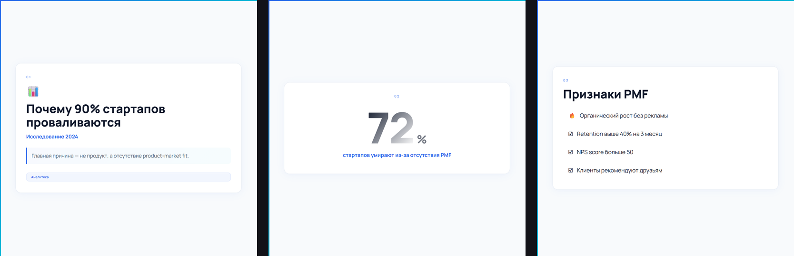
<br/><br/>
Светлый фон, синие акценты, чистая типографика. Идеально для: онлайн-школ, экспертов, B2B-контента.
</details>

<details>
<summary><b>🎯 Custom Brand — Цвета вашего бизнеса</b></summary>
<br/>
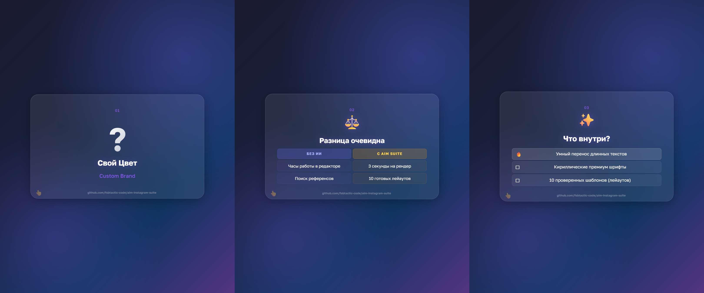
<br/><br/>
Умная подстройка под цвета вашего бренда (WCAG AA). Сгенерируется автоматически, если вы используете aim_auto_brand_colors.
</details>

---

## 📐 10 премиум-шаблонов

Для каждой карточки ИИ сам подбирает правильный формат подачи — чтобы зрителю было удобно читать списки, чек-листы или сравнения:

<div align="center">
  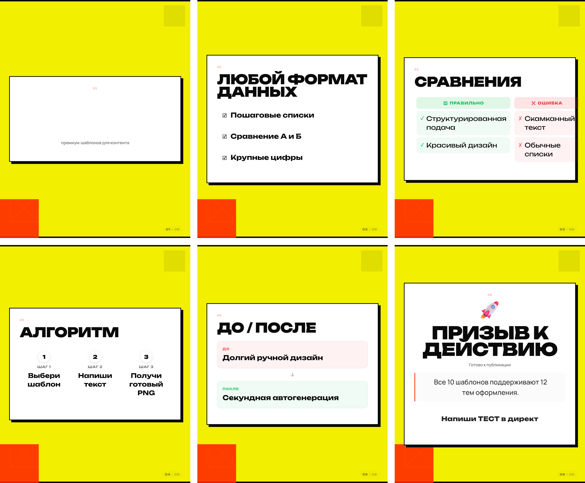
</div>

---

## ⚡ Установка — один промпт

Скопируйте этот промпт, вставьте в чат вашего ИИ-агента — и он всё сделает сам:

> Установи MCP-сервер **AIM Instagram Suite**. Вот пошаговый план — выполни всё автоматически:
>
> **1. Клонируй и установи зависимости:**
> ```
> git clone https://github.com/fsbtactic-code/aim-instagram-suite.git ~/Desktop/aim-instagram-suite
> cd ~/Desktop/aim-instagram-suite
> node scripts/setup.js
> ```
> Скрипт `setup.js` автоматически проверит Node.js 18+, установит C++ Build Tools (Windows) / Xcode CLT (Mac), CMake, npm-пакеты, Chromium для Puppeteer и yt-dlp. Если на Windows он попросит перезапустить терминал после установки Build Tools — сделай это и запусти `node scripts/setup.js` повторно.
>
> **2. Подключи MCP-сервер** — определи на какой платформе ты работаешь и выполни нужное:
> - **Claude Code CLI**: `claude mcp add aim-instagram-suite -- npx tsx "ПУТЬ/src/index.ts"` (подставь абсолютный путь к склонированной папке)
> - **Claude Desktop**: открой конфиг (`%APPDATA%\Claude\claude_desktop_config.json` на Windows или `~/Library/Application Support/Claude/claude_desktop_config.json` на Mac) и добавь в `mcpServers`: `"aim-instagram-suite": { "command": "npx", "args": ["tsx", "АБСОЛЮТНЫЙ_ПУТЬ/src/index.ts"] }`
> - **Cursor**: открой `~/.cursor/mcp.json` и добавь аналогичную запись в `mcpServers`
> - **Antigravity / Gemini**: открой `~/.gemini/antigravity/mcp_config.json` и добавь запись с `"env": {}`
> - **Windsurf**: открой `~/.codeium/windsurf/mcp_config.json` и добавь запись
>
> **3. Скопируй slash-команды** (если поддерживаются):
> - Claude Code: `cp .claude/commands/aim-*.md ~/.claude/commands/` (или `Copy-Item` на Windows)
> - Antigravity: `cp -r .gemini/commands/aim ~/.gemini/commands/` (или `Copy-Item -Recurse` на Windows)
> - Cursor: `cat .claude/commands/aim-*.md > .cursor/rules/aim-instagram-suite.mdc`
>
> **4. Перезапусти** среду и подтверди что появились **14 инструментов** `aim_`. Перечисли их.

**Готово!** После вставки промпта — ИИ клонирует, установит, подключит и проверит. Вам останется только перезапустить приложение.

📖 [Детальная инструкция для каждой платформы](INSTALL.md)

---

## 📦 Полный список инструментов (14 штук)

<details>
<summary><b>🎬 Видео-аналитика (5 инструментов)</b></summary>

| Инструмент | Что делает |
|------------|-----------|
| `aim_evaluate_video` | Оценка виральности видео (0-100) по 7 критериям |
| `aim_analyze_viral_reels` | Скачивает Reel/TikTok, транскрибирует, разбирает структуру |
| `aim_generate_script` | Генерация сценария по формуле успешного ролика |
| `aim_analyze_hook` | Анализ хука (первые 5 сек) + 5 вариантов усиления |
| `aim_extract_pacing` | Обнаруживает «провисания» — где зритель начнёт скучать |
</details>

<details>
<summary><b>🎨 Карусель-студия (4 инструмента)</b></summary>

| Инструмент | Что делает |
|------------|-----------|
| `aim_draft_carousel_structure` | Генерация текстовой структуры карусели (3-15 слайдов) |
| `aim_render_premium_carousel` | Рендер готовых PNG через Puppeteer в 7 дизайнах |
| `aim_auto_brand_colors` | Настройка фирменных цветов с проверкой контраста |
| `aim_create_style` | Интерактивный мастер создания кастомного стиля |
</details>

<details>
<summary><b>🔥 Аналитика и разведка (5 инструментов)</b></summary>

| Инструмент | Что делает |
|------------|-----------|
| `aim_score_virality` | Индекс виральности видео (0-100) |
| `aim_score_carousel_virality` | Индекс виральности карусели (0-100) |
| `aim_analyze_carousel` | Реверс-инжиниринг чужой карусели |
| `aim_localize_carousel` | Копировать / перевести / адаптировать чужую карусель |
| `aim_viral_structure` | Библиотека из 12 вирусных структур карусели |
</details>

---

## 🔒 Приватность

Вся обработка происходит **на вашем компьютере**:

- 🎙️ Транскрипция голоса — локальный Whisper
- 🖼️ Рендер картинок — локальный Puppeteer
- 📁 Видеофайлы — остаются на вашем диске
- 🚫 Никаких серверов, подписок и передачи данных

---

## 🤓 Техническая документация

Хотите разобраться сами? Посмотрите:
- [Архитектура проекта](docs/TECH_ARCHITECTURE.md) — пайплайны, API, внутреннее устройство
- [Подробная установка](INSTALL.md) — для Claude Desktop, Cursor, Windsurf

---

<div align="center">
  <br/>
  <b>Сделано для автоматизации Инстаграм-рутины</b><br/>
  <sub>fsbtactic-code · MIT License · v3.1.0</sub>
</div>
